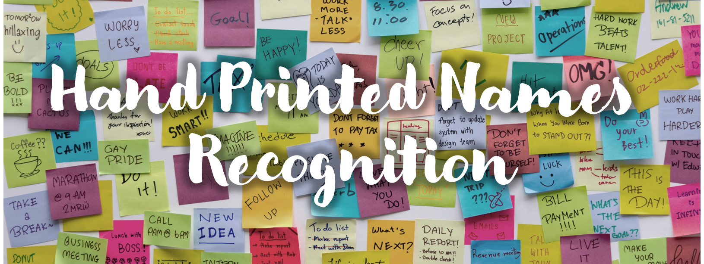
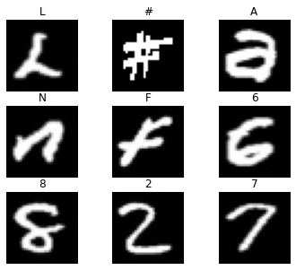
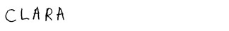
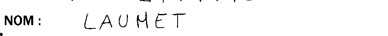
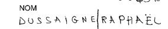

## Using Convolutional Neural Networks to convert handwritten names images into machine-encoded text
Author: [Edward De Jesus](https://github.com/edejesus196) | Web App developer: [Amauris De Jesus ](https://github.com/Amauris)

## Repository Structure
    
    ├── images                            Images
    ├── presentation                      Final PowerPoint presentation slideshows
    ├── main_notebook.ipynb               Final notebook 
    ├── pneumoniaCDC2010.csv              CDC data used for timeseries chart of pnuemoia cases
    └── README.md                         ReadMe

## Overview

Recognizing hand printed text has been a challenge for Optical Character Recognition (OCR) because of handwritten texts’ many variations. With the rise of machine learning and higher processing power, however, modern OCR technology is now better at recognizing more subtle patterns in text, and, thus, although not perfect, better at recognizing hand handwritten text. 

The ability to automate the process of converting handwriting text to machine-encoded text with the aid of machine learning has a lot of potential as a business application. The [U.S. LIbrary of Congress](https://www.loc.gov/rr/mss/), for example, holds approximately **sixty million manuscripts**, which are documents written by hand rather than typed or printed. Improving handwritten text recognition using machine learning can be of tremendous help with improving **searchability**, **readability** and **accessibility** of these documents, many of which are of [historical significance](https://guides.loc.gov/manuscripts-illustrated-guide).

## Approach

In this project I will demonstrate how to convert images of handwritten names into machine-encoded text using machine learning and computer vision techniques. Three major steps were taken to accomplish this task:

### Data and model preparation process
1. **Acquire datasets**
2. **Create models to predict characters**
3. **Perform character segmentation and names trancriptions**

#### Datasets
Two datasets, both obtained from Kaggle.com, were used to train the models and to test the model that performed best on the validation set.

The first dataset is called the [Handwritten characters dataset](https://www.kaggle.com/vaibhao/handwritten-characters). This dataset was used to train the models to recognize the different characters. It contains 39 classes in total. This includes all lowercase and uppercase English alphabet character, digits from 0-9, and some special characters, which include @, #, $, &. This dataset is divided into  834,036 training samples and 22,524 validation samples.

<figure>
  
  <figcaption><em>Samples from Handwritten Characters dataset</em></figcaption>
</figure>

The second dataset is called the [Handwritten names dataset](https://www.kaggle.com/landlord/handwriting-recognition). This dataset was  used to test the model’s ability to recognize characters of unseen data by predicting on individual characters and then appending these predictions into one word and  forming a name.  The dataset contains 206,799 images of first names and 207,024 of last names. 

<figure>
    <kbd></kbd>
    
    
  <figcaption><em>Samples from Handwritten Names dataset</em></figcaption>
</figure>

#### Modeling
Three models were trained on the Handwritten Character dataset. The baseline model, a K nearest Neighbors classifier, achieved its highest accuracy of 93.55% score with 1 neighbor. The best performing model overall was a deep convolutional neural network with 7 layers and 345,959 parameters. See chart below for details on the models' performance.

|Model      |Description                 |Val set loss|Val set accuracy|
|:----------|:---------------------------|:-----------|:---------------|
|KNN Model  |1 Neighbor                  |--          |93.55%          |
|CNN Model 1|4 layers, 163,367 parameters|0.1826      |94.62%          |
|CNN Model 2|7 layers, 345,959 parameters|0.0864      |97.19%          |

#### Character segmentation and names transcriptions

## Results

## Next Steps